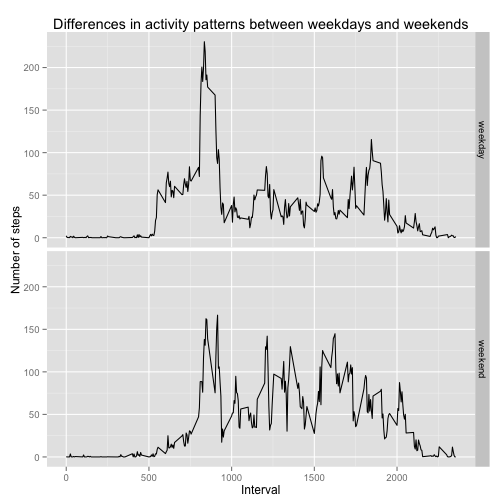

# Reproducible Research: Peer Assessment 1


## Loading and preprocessing the data

We will first start with unzipping and loading the data for this analysis.  
The below code assumes that the data is present in your working directory (where this file is located) and is called *activity.zip*.  
After loading the dataset we will also convert the *date* variable to a *Date* type.


```r
unzip("activity.zip")
data <- read.csv("activity.csv")
data$date <- as.Date(data$date, "%Y-%m-%d")
```

Structure and summary of the resulting dataset:


```r
str(data)
```

```
## 'data.frame':	17568 obs. of  3 variables:
##  $ steps   : int  NA NA NA NA NA NA NA NA NA NA ...
##  $ date    : Date, format: "2012-10-01" "2012-10-01" ...
##  $ interval: int  0 5 10 15 20 25 30 35 40 45 ...
```

```r
summary(data)
```

```
##      steps            date               interval   
##  Min.   :  0.0   Min.   :2012-10-01   Min.   :   0  
##  1st Qu.:  0.0   1st Qu.:2012-10-16   1st Qu.: 589  
##  Median :  0.0   Median :2012-10-31   Median :1178  
##  Mean   : 37.4   Mean   :2012-10-31   Mean   :1178  
##  3rd Qu.: 12.0   3rd Qu.:2012-11-15   3rd Qu.:1766  
##  Max.   :806.0   Max.   :2012-11-30   Max.   :2355  
##  NA's   :2304
```


## What is the mean total number of steps taken per day?

We'll first calculate the total number of steps taken each day. As per the requirements we will ignore missing values in the dataset:


```r
data.no.na <- subset(data, !is.na(data$steps))
steps.per.day <- aggregate(data.no.na$steps, by=list(data.no.na$date), FUN=sum)
names(steps.per.day) <- c("date","steps")
```

We'll now show the distribution of the total number of steps taken per day using a Histogram:


```r
hist(steps.per.day$steps, xlab="Total steps per day", main="Total number of steps taken each day")
```

 

As we can see, we have more than 25 days with between 10,000-15,000 total steps taken.  
<br/>
Finally, we'll calculate the **Mean** and **Median** of the total number of steps taken each day: 


```r
mean(steps.per.day$steps)
```

```
## [1] 10766
```

```r
median(steps.per.day$steps)
```

```
## [1] 10765
```


## What is the average daily activity pattern?

We'll start by plotting the average number of steps taken in each 5-minute interval averaged across all days on a time series.


```r
ap <- aggregate(data.no.na$steps, by=list(data.no.na$interval), mean)
names(ap) <- c("interval","avgsteps")
plot(x=ap$interval, y=ap$avgsteps,type="l", xlab="5-minute interval", ylab="Average number of steps taken", main="Average number of steps taken by 5-minute interval")
```

 

We can see from the time series that the 5-minute interval with the highest average number of steps taken across all days is located somewhere between the 500th and 1000th 5-minute interval.  
We'll now calculate the exact 5-minute interval with the highest number of average steps taken:


```r
head(ap[order(ap$avgsteps,decreasing=T),],1)
```

```
##     interval avgsteps
## 104      835    206.2
```

We can now clearly see that the 5-minute interval with the highest number of average steps taken across all days is the **835th** 5-minute interval with **~206** steps taken on average.


## Imputing missing values

We'll first calculate the total number of NA values in the dataset:


```r
sum(is.na(data))
```

```
## [1] 2304
```

We'll now fill in all instances of 5-minute intervals that are missing step data (NA) with the the mean for that 5-minute interval across all days:


```r
data.na <- subset(data, is.na(data$steps))
tmp <- merge(data.na, ap, by.x="interval", by.y="interval")
tmp$steps <- tmp$avgsteps
tmp$avgsteps <- NULL

data.complete <- rbind(data.no.na,tmp)
data.complete <- data.complete[order(data.complete$date, data.complete$interval),]
row.names(data.complete) <- NULL
```

Structure and summary of the resulting dataset:


```r
str(data.complete)
```

```
## 'data.frame':	17568 obs. of  3 variables:
##  $ steps   : num  1.717 0.3396 0.1321 0.1509 0.0755 ...
##  $ date    : Date, format: "2012-10-01" "2012-10-01" ...
##  $ interval: int  0 5 10 15 20 25 30 35 40 45 ...
```

```r
summary(data.complete)
```

```
##      steps            date               interval   
##  Min.   :  0.0   Min.   :2012-10-01   Min.   :   0  
##  1st Qu.:  0.0   1st Qu.:2012-10-16   1st Qu.: 589  
##  Median :  0.0   Median :2012-10-31   Median :1178  
##  Mean   : 37.4   Mean   :2012-10-31   Mean   :1178  
##  3rd Qu.: 27.0   3rd Qu.:2012-11-15   3rd Qu.:1766  
##  Max.   :806.0   Max.   :2012-11-30   Max.   :2355
```


```r
sum(is.na(data.complete))
```

```
## [1] 0
```

As we can see the **2304** NA values for the *steps* variable are now gone.  
<br/>
#### We'll now examine the impact of imputing missing data on the estimates of the total daily number of steps:

We'll first calculate the total number of steps taken each day using the new complete dataset:


```r
steps.per.day.complete <- aggregate(data.complete$steps, by=list(data.complete$date), FUN=sum)
names(steps.per.day.complete) <- c("date","steps")
```

We'll now show the distribution of the total number of steps taken per day using a Histogram:


```r
hist(steps.per.day.complete$steps, xlab="Total steps per day", main="Total number of steps taken each day")
```

 

As we can see, there is no major change in the distribution of data after imputing the NA values. We do see however that there seem to be more days with between 10,000-15,000 total steps taken.  
<br/>
We'll now calculate the **Mean** and **Median** of the total number of steps taken each day: 


```r
mean(steps.per.day.complete$steps)
```

```
## [1] 10766
```

```r
median(steps.per.day.complete$steps)
```

```
## [1] 10766
```

As we can see, again no major change between the **Mean** and **Median** of the dataset after imputing the NA values.
The **Mean** has not changed at all and the **Median** has increased by 1, from **10765** to **10766**.


## Are there differences in activity patterns between weekdays and weekends?

We'll start by classifying each instance of our *date* variable as "weekday" or "weekend". We'll store this data in a new Factor variable called *day.type*.


```r
data.complete$day.type <- as.factor(sapply(data.complete$date,function(x) ifelse(weekdays(x) %in% c("Saturday","Sunday"),"weekend","weekday")))
```

Structure and summary of the resulting dataset:


```r
str(data.complete)
```

```
## 'data.frame':	17568 obs. of  4 variables:
##  $ steps   : num  1.717 0.3396 0.1321 0.1509 0.0755 ...
##  $ date    : Date, format: "2012-10-01" "2012-10-01" ...
##  $ interval: int  0 5 10 15 20 25 30 35 40 45 ...
##  $ day.type: Factor w/ 2 levels "weekday","weekend": 1 1 1 1 1 1 1 1 1 1 ...
```

```r
summary(data.complete)
```

```
##      steps            date               interval       day.type    
##  Min.   :  0.0   Min.   :2012-10-01   Min.   :   0   weekday:12960  
##  1st Qu.:  0.0   1st Qu.:2012-10-16   1st Qu.: 589   weekend: 4608  
##  Median :  0.0   Median :2012-10-31   Median :1178                  
##  Mean   : 37.4   Mean   :2012-10-31   Mean   :1178                  
##  3rd Qu.: 27.0   3rd Qu.:2012-11-15   3rd Qu.:1766                  
##  Max.   :806.0   Max.   :2012-11-30   Max.   :2355
```

We'll now plot the 5-minute interval and the average number of steps taken, averaged across all weekday days or weekend days on a time series:


```r
library("ggplot2")
ap <- aggregate(data.complete$steps, by=list(data.complete$day.type,data.complete$interval), mean)
names(ap) <- c("day.type","interval","avgsteps")
qplot(x=interval, y=avgsteps, data=ap, geom="line", facets= day.type ~., xlab="Interval", ylab="Number of steps", main="Differences in activity patterns between weekdays and weekends")
```

 
